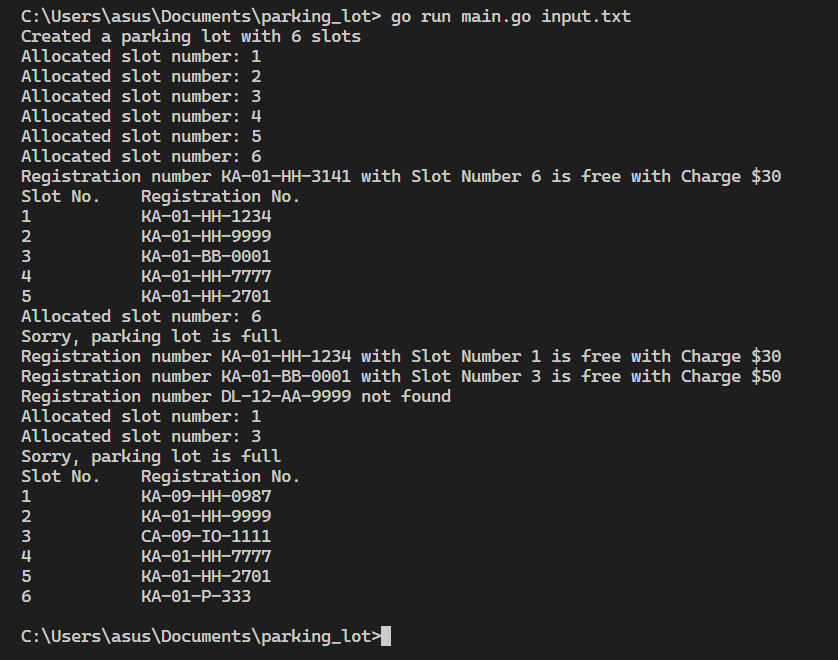

# Parking Lot Application

This is a Go-based automated parking lot ticketing system that manages parking slots, issues tickets, and calculates parking charges based on parking duration.

## Prerequisites

- Go 1.16 or higher

## Directory Structure

```
parking_lot/
├── main.go       # Main application logic
├── input.txt     # Sample input commands
└── README.md     # Project documentation
```

## How to Run

1. Clone or download this repository.
2. Navigate to the `parking_lot` directory.
3. Run the application with an input file:
   ```bash
   go run main.go input.txt
   ```

## Output

